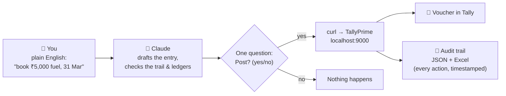

# ai-direct-agent-voucher

**Talk to your TallyPrime in plain English. It types the vouchers for you — and never without your yes.**

You say: *"book ₹5,000 cash fuel expense on 31st March"*.
It shows you the entry, asks **"Post? (yes/no)"**, and on *yes* it's in Tally — logged, timestamped,
un-duplicatable, and reversible. That's the whole product.

This is a **skill** (a set of instructions + one small helper script) for
[Claude Code](https://claude.com/claude-code), Anthropic's AI assistant that runs on your own PC. No cloud
accounting service, no add-on inside Tally, no data leaving your machine — the AI talks to TallyPrime through
the same local doorway (the "HTTP-XML gateway") that Tally has shipped with for years.

---

## How it works (30 seconds)



Three hard rules are built into the skill:

| # | Rule | What it means for you |
|---|------|----------------------|
| 1 | **Nothing is written without your yes** | Every post / change / delete shows you a one-line summary and waits for your confirmation. Reading reports is always free. |
| 2 | **Everything is on the record** | Every action lands in a local audit trail — a JSON file (machine-readable, session-keyed, timestamped) and an Excel file (open it, read it). Nothing can be double-posted: the skill checks the trail before every entry, and every voucher carries a permanent ID so re-running *updates* instead of duplicating. |
| 3 | **Your chart of accounts is protected** | The AI never invents a ledger. Every ledger name is matched against the ones that actually exist in your book (typos like "office expence" are caught → *"Did you mean 'Office Expenses'?"*). Creating or changing a ledger always requires your explicit yes. |

---

## What you need

| Thing | Details |
|---|---|
| A Windows PC | The one your Tally runs on. |
| **TallyPrime** | Any recent version (TallyPrime, TallyPrime Edit Log, Tally.ERP 9 mostly works too). A valid licence — in Educational mode, Tally only accepts entries dated the 1st/2nd/last day of a month. |
| **Claude Code** | Anthropic's AI assistant app — [download here](https://claude.com/claude-code). The free tier works; paid tiers are faster. |
| **Python** | Free, one-time install from [python.org](https://www.python.org/downloads/) (tick *"Add to PATH"* during install). Used only for the little record-keeping script — you never run it yourself. |

You do **not** need to know how to code. You never type the technical commands you'll see inside the files —
the AI runs them for you. Your job is to **ask, check, approve**.

## Setup (10 minutes, once)

1. **Turn on Tally's doorway.** Open TallyPrime → load your company → press **F1 → Settings → Connectivity**
   → set *TallyPrime acts as* = **Both**, *Port* = **9000**. Keep Tally running.
2. **Install this skill.** Download this repository (green **Code** button → *Download ZIP*), unzip it, and
   copy the whole folder to:
   `C:\Users\<you>\.claude\skills\ai-direct-agent-voucher`
   (Create the `skills` folder if it doesn't exist.)
3. **Open Claude Code** in any working folder and say:
   > *check my tally connection*

   The AI will probe the gateway, tell you which company it sees, and you're live.

**Practice safely first:** create a throwaway company in Tally (any junk name) and play there. Point it at
real books only when you're comfortable. For a full practice sandbox with lessons, see the companion project
[tally-integration](https://github.com/puneetkeshav/tally-integration).

---

## What do I actually say to it?

Copy any of these, change the numbers:

**Enter things**
> book ₹5,000 cash fuel expense on 31st March
> received 40,000 consulting fee from Client ABC into HDFC bank on 31 Dec
> transferred 15,000 from HDFC to cash on 1st Jan
> pass a journal for 25,000 rent provision on 31 Jan
> post these 12 bank statement lines *(paste them / point to the Excel)*

**Fix things**
> that fuel entry should be 5,500, not 5,000
> change the date of the rent journal to 28 Feb
> delete the duplicate receipt from yesterday

**Ask things**
> show me the trial balance
> what did I post today?
> show me everything in this session
> how much did we spend on conveyance this year?
> give me the HDFC ledger for the year with a running balance

**Reconcile things**
> reconcile HDFC against this bank statement — show me only the dates that don't match
> compare my TDS ledgers to this 26AS
> enter whatever's missing from this statement (it gap-analyses first, shows you the batch, one yes posts it)

Every "enter/fix/delete" gets you a one-line preview and a *"Post? (yes/no)"*. Every question just gets
answered.

## The audit trail

After your first entry you'll find a `tally-session` folder wherever you ran Claude Code:

```
tally-session/
├── MyCompany__trail.json   ← the source of truth: every action, timestamped, keyed by session
├── MyCompany__trail.xlsx   ← the same trail as a spreadsheet — open it anytime
└── _outbox/                ← the exact XML sent to Tally (for the curious / for audits)
```

Each record holds: what was done (post/alter/delete/ledger-created), when, in which session, the voucher's
permanent ID, its ledger legs, and Tally's own confirmation counts. Ask *"show me this session"* and the AI
reads it back. Because every voucher carries its permanent ID (`REMOTEID`), re-posting the same entry
**updates it in place** — it is structurally impossible to double-post by accident.

## Is this safe? (honest answers)

- **Can it post without asking?** No. The confirmation gate is the skill's Rule 0. Reads (reports, trial
  balance) run freely because they cannot change data.
- **Can it mess up my ledgers?** It refuses to invent ledger names. Everything is fuzzy-matched against your
  actual chart of accounts; creations/changes need your explicit yes, and are logged.
- **Can it hang Tally?** Tally's gateway is single-threaded and one specific kind of request (bulk ledger
  *collection* queries) can stall it. The skill is hard-coded to never use those — it uses only the proven-safe
  report exports. (A stalled *read* can't corrupt data anyway; worst case you restart Tally.)
- **Does my data go anywhere?** The voucher text you type goes to the AI (Anthropic) like any Claude
  conversation. Tally itself is only ever touched locally on `localhost:9000`. The audit trail stays on your
  disk. Back up before bulk work on a real book (Tally: **Alt-F3 → Backup**) — the skill reminds you.
- **Who makes the accounting judgement calls?** You. The skill's standing orders keep tax judgement,
  classifications and corrections with the human — it drafts and types; you decide.

## Troubleshooting (human edition)

| What you see | What it means | What to do |
|---|---|---|
| "Gateway isn't responding" | Tally closed, company not loaded, or doorway off | Open Tally, load the company, F1 → Settings → Connectivity → Both / 9000 |
| "That date is being rejected" | Educational mode (no licence) only allows 1st/2nd/last-day dates | Check the licence — the error message Tally gives is misleading |
| "Ledger 'X' does not exist" | Name typo, or genuinely missing | The AI will show you the closest real names, or offer to create it — your call |
| Tally window frozen | A heavy read is churning | Wait it out or restart Tally — reads cannot corrupt your data |
| "Duplicate caught" | You (or a re-run) tried to enter the same voucher again | That's the trail doing its job. Say "yes, post anyway" only if it's genuinely a second identical transaction |

More depth for technical readers: [`references/troubleshooting.md`](references/troubleshooting.md).

## For the technically curious

- **Architecture:** the AI builds one small XML file per action and `curl`s it to Tally's documented HTTP-XML
  gateway. A Python helper ([`scripts/ledger.py`](scripts/ledger.py)) builds the XML (it owns the
  notorious Dr/Cr sign convention), fuzzy-matches ledger names (difflib), keeps the JSON/Excel trail, and
  turns a reviewed batch sheet into per-voucher XMLs (`sheet`). The helper never talks to Tally — every byte
  that reaches your books went through a visible curl call.
- **Reporting:** [`scripts/tally_report.py`](scripts/tally_report.py) (read-only, stdlib-only) pulls the
  Voucher Register for a date range once into a local SQLite cache, then answers trial balance, P&L, ledger
  statements with running balance, bank reconciliation by net daily movement, TDS-vs-26AS, and ad-hoc SQL —
  instantly, and without the balance-computation reads that can hang Tally's single-threaded gateway.
  (Adapted from tally-integration's `tally_report.py`.)
- **Per-company conventions:** an optional `<company>__conventions.md` next to the trail records the owner's
  narration style, verbatim ledger map and recurring posting recipes, so entries come out indistinguishable
  from the owner's ([template](references/conventions-template.md)).
- **Idempotency:** every voucher carries an externally-set `REMOTEID`; re-posting the same ID alters in place,
  and deletes address the same ID. See [`references/gateway-reference.md`](references/gateway-reference.md)
  for the protocol details, response schema and official sources.
- **The skill itself** is [`SKILL.md`](SKILL.md) — the standing orders Claude reads. The `references/` files
  load on demand (voucher recipes, safe reads, failure modes, master creation).

## Credits & licence

Built on lessons from [puneetkeshav/tally-integration](https://github.com/puneetkeshav/tally-integration)
(the practice sandbox, the quirks list, and the golden rules) and Tally's official developer documentation.

MIT — free to use, modify, share. Provided as-is, no warranty; you are responsible for what you post to your
own books. **Never commit real client data to a public repository.**
